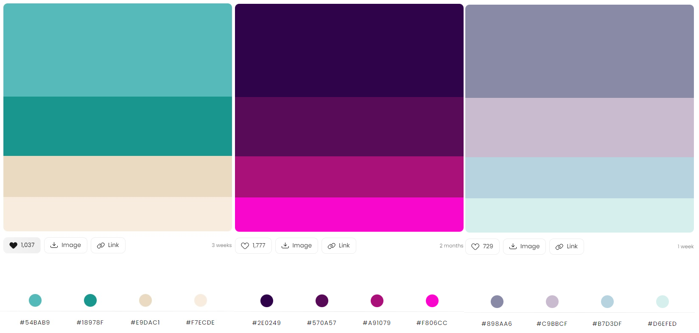

#Formulario para cadastro

Formulario para cadastro de Fornecedores...

<a href="#imagens">Imagens </a> -
<a href="#sobre">Sobre </a> -
<a href="#features">Features </a> -
<a href="#tecnologias">Tecnologias </a> -
<a href="#executar">Como executar o projeto</a> -
<a href="#autor">Autor </a>

# Imagens

- Responsividade desktop e mobile utilizando "flex". 
- Cores utilizadas de acordo com a paleta disponibilizada na documentação.

<table>
  <tr>
    <td>Estilo - Seletor de cores</td>
  </tr>
  <tr>
    <td valign="top"></td>
  </tr>
 </table>

# Sobre
Formulario FrontEnd HTML5 / css3 / Bootstrap + Datatable

- Estudo e desenvolvimento para cadastro de Fornecedores com validações em seus inputs.
- Interface para cadastro de Cliente/Fornecedor 
- Datatable para listar intens cadastrados.
- Validação de CEP com autocomplit 
- *Em construção validação e mascara para CNPJ 
- utilizando o https://viacep.com.br/ws/ para validar o CEP nos campos de input 

# Features
Desafios adicionais inserido ao projeto:
- [x] Implementado responsividade.
- [x] Criar seletor de cores (Temas dinamicos).
- [x] Validar CEP e preencher complementos automaticamente.
- [] Adicionar mascara ao campo de CNPJ.
- [] Melhorar logica para seletor de cores da função <b>seletorColors()</b>
- [] Melhorar visual dos botoes Alterar dentro do DataTable.
- [] Aprimorar Navbar da pagina.
- [] Padronizar ICONs.

# Tecnologias
<ul>
<li>HTML 5</li>
<li>CSS 3</li>
<li>Bootstrap 5</li>
<li>Datatable 4 (responsivo)</li>
<li>Sweetalert 2</li>
<li>Google Font API</li>

</ul>

# Executar
<strong> | Passos para executar o projeto localmente :</strong>

<b>1</b> Em breve disponibilizarei os requisitos locais...  
<b>2</b> 
<b>3</b> 
<b>4</b> 

Referencia para paletas de cores <a href="https://colorhunt.co/">Color Hunt</a> utilizada neste projeto.  

Para editar o projeto é necessario ter instalado em sua maquina um editor de codigos. 
Recomendo utilizar o <a href="https://code.visualstudio.com/download" target="_blank">VSCODE</a> por ser compativel com a maioria dos hardwares atualmente. 

# Autor

Desenvolvido por: :nerd_face: <a href="https://github.com/NeillonWork"><strong> NeillonWork</strong>

